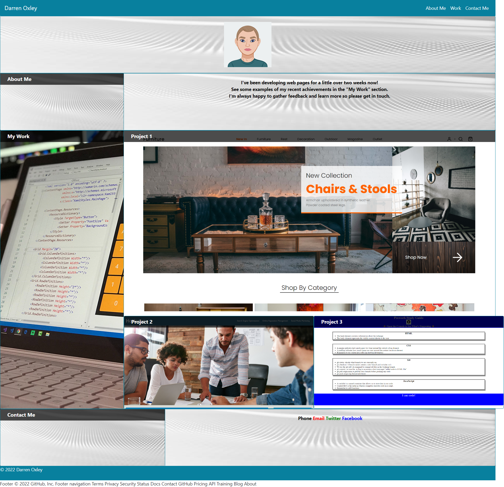
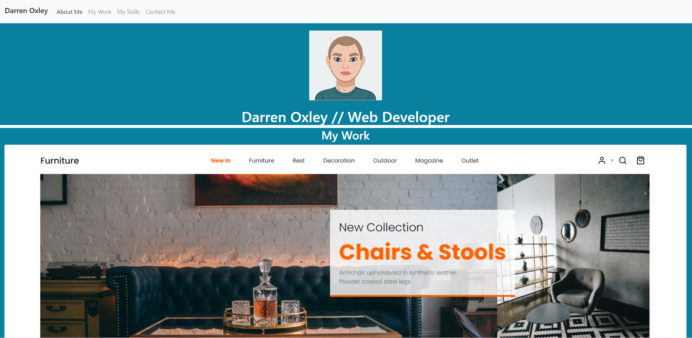

# Bootstrap-Portfolio (Challenge-3)

## Description

### The Task

I was tasked with recreating a portfolio page for myself using Bootstrap, whilst meeting the minimum requirements (listed below).

I initially thought I should replicate my [first portfolio webpage ](https://darrenoxley7.github.io/challenge-2/) (which I completed) but it felt like trying to bend Bootstrap to do what I needed it to, rather than working with what it was created to do. My initial commit in [My GitHub repo](https://github.com/DarrenOxley7/Bootstrap-Portfolio.git) still contains the first attempt, and a screen shot is below (fig.1), but I decided to start from scratch and design the page around Bootstrap (fig.2).

fig.1

fig.2

## The requirements

The website should include the following bootstrap components:

    - A Navigation bar
    - A navigation menu at the top.
      - Include links that are applicable to your portfolio.
        - Links should navigate to the appropriate sections 

    - A hero section
        - A jumbotron featuring your picture, your name, and any other information you'd like to include.

    - A work section
      - A section displaying your work in grid. 
      - Use bootstrap cards for each project.
        - The description should give a brief overview of the work.

    - A skills section
      - List out the skills you expect to learn from the bootcamp.

    - An about / contact section.
      - An "About Me" section in the same row.
    
    - A footer section.
      - All hyperlinks should have a hover effect.
      - All buttons should display a box shadow upon hover.

## Usage

To access the website, navigate to [my portfolio webpage ](https://darrenoxley7.github.io/Bootstrap-Portfolio/). There is a nav menu at the top and in the footer which will navigate to the relevant area of the page. There are also links in the Contact Me section, however these are only for demontation purposes. 

I do not have a Twitter or Facebook account so these are set to link to their respective homepages. The Phone link will call "0" and the Email link will add an example email address to the recipient field in a users preferred email account. It is my intention to update these links as I progress.

## Installation

To view the code navigate to the website using the link above and right click on any website element and cick inspect or download the source code from [My GitHub repo](https://github.com/DarrenOxley7/Bootstrap-Portfolio.git) and open the index.html file in VS Code.

## Credits

* [Card hovers] (https://ordinarycoders.com/blog/article/codepen-bootstrap-card-hovers)

### Resources:

* [Bootstrap] (https://getbootstrap.com/docs/4.4/)
* [Card hovers] (https://ordinarycoders.com/blog/article/codepen-bootstrap-card-hovers)
## License

MIT License

Copyright (c) 2022 DarrenOxley7

Permission is hereby granted, free of charge, to any person obtaining a copy
of this software and associated documentation files (the "Software"), to deal
in the Software without restriction, including without limitation the rights
to use, copy, modify, merge, publish, distribute, sublicense, and/or sell
copies of the Software, and to permit persons to whom the Software is
furnished to do so, subject to the following conditions:

The above copyright notice and this permission notice shall be included in all
copies or substantial portions of the Software.

THE SOFTWARE IS PROVIDED "AS IS", WITHOUT WARRANTY OF ANY KIND, EXPRESS OR
IMPLIED, INCLUDING BUT NOT LIMITED TO THE WARRANTIES OF MERCHANTABILITY,
FITNESS FOR A PARTICULAR PURPOSE AND NONINFRINGEMENT. IN NO EVENT SHALL THE
AUTHORS OR COPYRIGHT HOLDERS BE LIABLE FOR ANY CLAIM, DAMAGES OR OTHER
LIABILITY, WHETHER IN AN ACTION OF CONTRACT, TORT OR OTHERWISE, ARISING FROM,
OUT OF OR IN CONNECTION WITH THE SOFTWARE OR THE USE OR OTHER DEALINGS IN THE
SOFTWARE.

